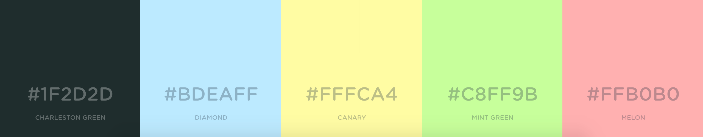
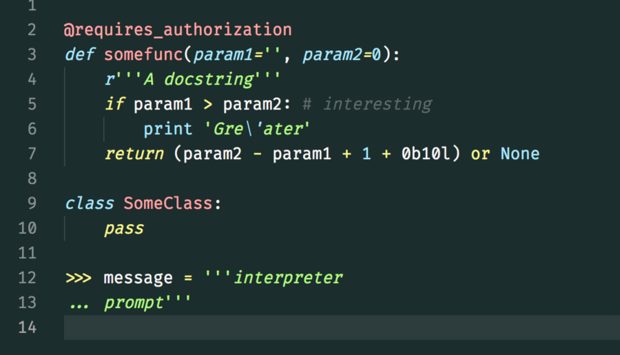
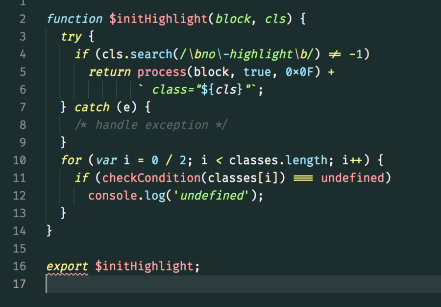
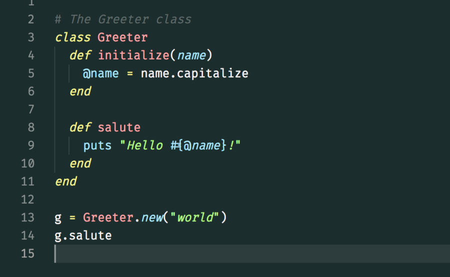
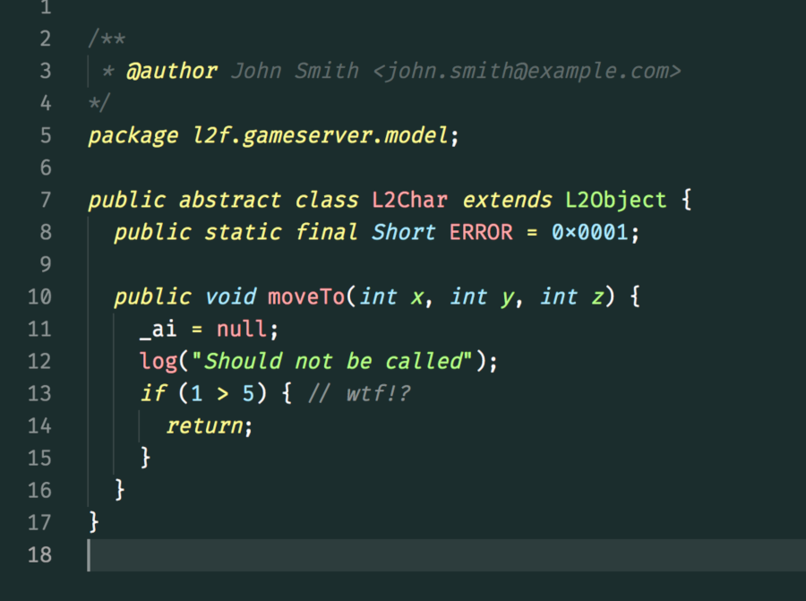
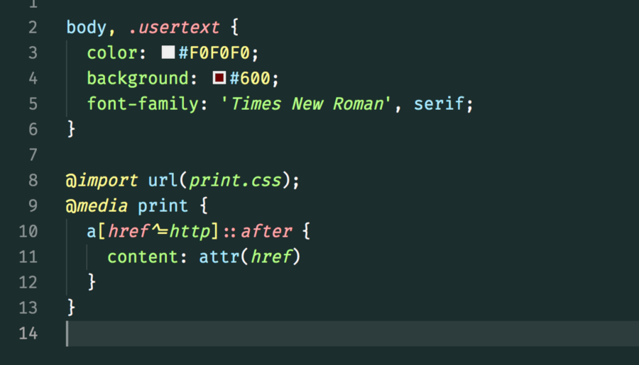

# Photophore

### Palette

- `#1f2d2d`/`#ffffff`
- `#bdeaff`
- `#fffca4`
- `#c8ff9b`
- `#ffb0b0`

## Previews

- [Python](#python)
- [Javascript](#javascript)
- [Ruby](#ruby)
- [Java](#java)
- [CSS](#css)

### Python

### Javascript

### Ruby

### Java

### CSS

---

> _Sample code stolen from https://highlightjs.org/_

> _Palette screenshot stolen from https://coolors.co_